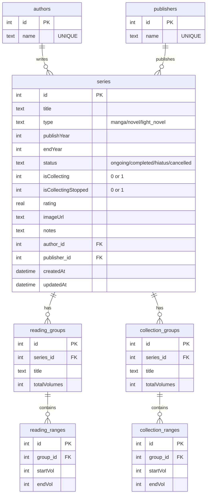

# 卍 Manga Tracker - ระบบบันทึกและติดตามสะสมมังงะและนิยายครบวงจร

**Manga Tracker** เป็นแอปพลิเคชัน Full-stack ประสิทธิภาพสูงที่ออกแบบมาสำหรับผู้รักการอ่านและการสะสมมังงะ (Manga), นิยาย (Novel) และไลท์โนเวล (Light Novel) โดยเฉพาะ ตัวระบบมุ่งเน้นเรื่อง **ความถูกต้องและความสมบูรณ์ของข้อมูล (Data Integrity)** ผ่านการออกแบบฐานข้อมูลเชิงสัมพันธ์แบบ Normalized (SQLite), ระบบจัดการช่วงเล่มด้วย Algorithm พิเศษ (Symmetric Range Merging), ความปลอดภัยของ API ด้วยการ Proxy และการตรวจสอบข้อมูลผ่าน Zod รวมถึงแยกการติดตามประวัติการอ่านออกจากการบันทึกหนังสือสะสม (เล่มจริง/ดิจิทัล) อย่างเป็นระบบ

---

## 🌟 คุณสมบัติเด่นของระบบ (Key Features)

### 1. ระบบบันทึกความคืบหน้าแบบสองชั้น (Dual-Layer Tracking)
ระบบแยกการติดตามหนังสือออกเป็น 2 ชั้นอย่างอิสระเพื่อให้สะท้อนสถานะจริงอย่างละเอียดที่สุด:
- **ประวัติการอ่าน (Reading Logs):** บันทึกช่วงเล่มที่อ่านแล้ว เช่น "เนื้อเรื่องหลัก (Main Story)" และ "ภาคแยก (Side Stories)"
- **คลังหนังสือสะสม (Collection Logs):** บันทึกจำนวนเล่มที่มีในครอบครอง โดยรองรับการแยกรูปแบบการสะสม (เล่มปกติ, Special Edition, E-Book) เพื่อไม่ให้สับสนในการเช็คชั้นหนังสือ
- **ระบบหยุดตามซื้อ ("เลิกตามแล้ว"):** สำหรับซีรีส์ที่ตัดสินใจหยุดสะสมต่อ สามารถเลือกสถานะ "เลิกตามแล้ว" ได้ โดยระบบจะยังคงเก็บบันทึกประวัติเล่มที่มีอยู่ในครอบครองไว้อย่างถูกต้อง แต่จะไม่นำซีรีส์นี้ไปแสดงใน "เช็กลิสต์หนังสือที่ยังขาด" และไม่นำไปนับรวมในตัวนับเล่มที่ยังขาด

### 2. ค้นหาข้อมูลอัตโนมัติผ่าน MyAnimeList API Proxy
- **Automated Metadata:** ค้นหาชื่อมังงะ/นิยายเพื่อดึงรูปปก, ชื่อผู้แต่ง (Authors), ปีที่ตีพิมพ์ และสถานะจาก MyAnimeList มาใส่ในฟอร์มโดยอัตโนมัติ
- **Secure Backend Proxy:** ฝั่ง Server ทำหน้าที่เป็น Proxy ปลอดภัยสูงเพื่อเรียกใช้ MAL API โดยช่วยซ่อน Client ID ของระบบจากฝั่ง Client และแก้ไขปัญหา CORS ในตัว

### 3. การออกแบบฐานข้อมูลแบบ Normalized Database & SQL Transactions
- **Data Normalization:** แยกตารางผู้แต่ง (`authors`) และตารางสำนักพิมพ์ (`publishers`) เป็นเอกเทศ เพื่อลดการซ้ำซ้อนของข้อมูลและเพิ่มประสิทธิภาพในการค้นหาและจัดหมวดหมู่
- **Transactional Consistency:** ทุกการแก้ไขและสร้างข้อมูลที่เกี่ยวข้องกับความสัมพันธ์แบบหลายชั้น จะทำงานภายใต้ `db.transaction()` เพื่อให้มั่นใจว่าการบันทึกข้อมูลจะสำเร็จทั้งหมดหรือล้มเหลวร่วมกัน (All-or-Nothing) ป้องกันปัญหาข้อมูลขยะค้างในระบบ
- **Performance Optimized:** มีการทำ Database Indexing บน Column ที่สำคัญ เช่น `title`, `type`, `status` เพื่อให้การค้นหาและฟิลเตอร์ข้อมูลทำได้อย่างรวดเร็วแม้จะมีปริมาณข้อมูลมาก

### 4. อัลกอริทึมรวมช่วงเล่มแบบสมมาตร (Symmetric Range Merging)
- **Auto-Consolidation:** ระบบจะจัดเรียงและย่อยช่วงเล่มที่กรอกซ้ำซ้อนหรือติดกันให้อยู่ในรูปแบบที่สั้นที่สุดโดยอัตโนมัติ (เช่น หากกรอกเล่ม `[1-5]`, `[6-10]` และ `[9-12]` ระบบจะรวมเป็นช่วง `[1-12]` ให้ทันที)
- **Symmetric Merge:** อัลกอริทึมทำงานอย่างสอดคล้องกันทั้งฝั่ง Frontend (เพื่อการแสดงผลและโต้ตอบที่ลื่นไหล) และฝั่ง Backend (เพื่อให้มั่นใจเรื่องความถูกต้องก่อนบันทึกลงฐานข้อมูล)

### 5. ระบบส่งออกข้อมูล CSV (Configurable CSV Export)
- **Flexible Export:** เลือกลำดับและคอลัมน์ที่ต้องการส่งออกได้อย่างอิสระ พร้อมหน้าพรีวิวข้อมูลแบบเรียลไทม์
- **Dual Layout Modes:** รองรับทั้งแบบ 1 แถวต่อ 1 ซีรีส์ (`series`) และแบบแยกแถวย่อยตามกลุ่มเล่มอ่าน/สะสม (`split_logs`)
- **Excel Thai Support:** เข้ารหัส UTF-8 พร้อม BOM (`\uFEFF`) เพื่อให้เปิดไฟล์ภาษาไทยใน Microsoft Excel ได้อย่างถูกต้องทันที

### 6. การตรวจสอบข้อมูลอย่างเข้มงวดด้วย Zod & TypeScript Strict Mode
- **Zero any TypeScript:** พัฒนาด้วย TypeScript ทั้ง Frontend และ Backend (`strict: true`) ไร้การใช้ `any`
- **Zod Schema Validation:** ตรวจสอบโครงสร้างและชนิดของข้อมูลในทุก ๆ API Request (ทั้ง `POST` และ `PATCH`) เพื่อป้องกันไม่ให้ข้อมูลผิดพลาดถูกบันทึกลงใน Database
- **Premium UI/UX:** หน้าเว็บที่พัฒนาด้วย React 18 และ Vanilla CSS ที่จัดแต่งสีสันและรูปแบบอย่างประณีต รองรับการแสดงผลแบบ Grid และ List, มี Sidebar ค้นหาและกรอง (ประเภทรวมถึง "เลิกตามแล้ว") ที่ทำงานแบบตอบสนองทันที และระบบช่วยเติมคำอัตโนมัติ (Autocomplete) 

---

## 🏗️ เทคโนโลยีที่เลือกใช้ (Technical Stack)

- **Frontend:**
  - React 18 (Vite) - ทั้งหมดเขียนด้วย TypeScript (`strict: true`)
  - Zustand (State Management ประสิทธิภาพสูง ไร้ Boilerplate)
  - Axios (Client API Layer)
  - Vanilla CSS (เขียน CSS ควบคุมโครงสร้างด้วยตัวแปรร่วมและการแบ่งสัดส่วนตาม Feature)
- **Backend:**
  - Node.js (Express) - ทั้งหมดเขียนด้วย TypeScript (`strict: true`, คอมไพล์ด้วย `tsc`)
  - `better-sqlite3` (SQLite Driver ภาษา C/C++ เร็วที่สุดแบบ Synchronous)
  - Zod (ระบบตรวจสอบ Schema และ Validation อย่างเข้มงวด)
- **Database:**
  - SQLite (Normalized relational database พร้อม Foreign Key Cascade และ Indexing)
- **DevOps:**
  - Docker & Docker Compose (พร้อมสำหรับการรันแอปพลิเคชันอย่างเป็นระเบียบ)

---

## 📂 โครงสร้างของโปรเจกต์ (Directory Structure)

```text
├── backend/
│   ├── data/                 # ที่เก็บไฟล์ฐานข้อมูล SQLite (เช่น manga.db)
│   ├── src/
│   │   ├── config/           # db.ts (เชื่อมต่อ DB & Migration), env.ts (ดึงค่า Env)
│   │   ├── controllers/      # ควบคุม Logic (seriesController, metadataController, malController)
│   │   ├── middleware/       # validate.ts (Middleware ตรวจ Zod Payload)
│   │   ├── routes/           # ประกาศเส้นทาง API (index.ts)
│   │   ├── utils/            # mapper.ts, validation.ts, migration.ts, errors.ts
│   │   └── index.ts          # จุดเริ่มต้นการทำงานของ Express Server
│   ├── Dockerfile
│   ├── package.json          # สคริปต์รันระบบฝั่ง Server ("dev", "build", "start", "seed")
│   └── .env                  # การตั้งค่าพอร์ต, คีย์ MAL และเส้นทางไฟล์ DB
│
├── frontend/
│   ├── src/
│   │   ├── api/              # Axios config และตัวเรียกฝั่ง Backend (seriesApi.ts)
│   │   ├── components/       # Icons.tsx, StarRating.tsx, RangeEditor.tsx, SortDropdown.tsx
│   │   ├── features/         # จัดกลุ่มโมดูลของ UI
│   │   │   ├── series/       # การแสดงการ์ดซีรีส์, รายการ, โมดัล และฮุกส์
│   │   │   │   ├── components/ # SeriesCard, SeriesListItem, SeriesInfoModal, ExportCsvModal, ฯลฯ
│   │   │   │   ├── hooks/      # useFilteredSeries.ts, useMissingVolumes.ts
│   │   │   │   └── Series.css
│   │   │   └── filters/      # แถบตัวกรองและกล่องค้นหา (FilterSidebar.tsx, FilterSidebar.css)
│   │   ├── store/            # useSeriesStore.ts (Zustand Global State)
│   │   ├── types/            # รวม Type ทั้งหมดของระบบ (index.ts, css.d.ts)
│   │   ├── utils/            # helpers.ts (อัลกอริทึมช่วงเล่ม), csvHelper.ts, constants.ts
│   │   ├── App.tsx           # โครงสร้างหน้าหลักและจัดวาง Sidebar / Toolbar
│   │   └── main.tsx          # จุดติดตั้ง React App
│   ├── Dockerfile
│   ├── package.json          # สคริปต์รันระบบฝั่ง Client ("dev", "build", "preview")
│   └── vite.config.ts
│
├── docker-compose.yml        # ตัวประสาน Containers ทั้ง Full-Stack
├── README.md                 # คู่มือแนะนำการใช้งานระบบและการติดตั้ง [ไฟล์นี้]
├── GEMINI.md                 # คู่มือสเปกและข้อกำหนดสำหรับ Gemini AI
└── CLAUDE.md                 # คู่มือสเปกและข้อกำหนดสำหรับ Claude AI
```

---

## 📊 โครงสร้างฐานข้อมูลเชิงสัมพันธ์ (Database Schema)

ตารางทั้งหมดถูกทำ Normalization เพื่อรักษาประสิทธิภาพและลดความซ้ำซ้อนของข้อมูล:



### ดัชนีประสิทธิภาพเพื่อเร่งความเร็วในการเรียกดู (Database Indexes)
- `idx_series_title` ทำบนตาราง `series(title)`
- `idx_series_type_status` ทำบนตาราง `series(type, status)`
- `idx_series_author_id` ทำบนตาราง `series(author_id)`
- `idx_series_publisher_id` ทำบนตาราง `series(publisher_id)`

---

## 🔌 API Reference (ระบบการสื่อสารผ่านเครือข่าย)

| Method | Endpoint | Description |
| :--- | :--- | :--- |
| **GET** | `/api/series` | ค้นหาและดึงข้อมูลหนังสือ (กรองตามคำค้นหา, ประเภท, สถานะ และการเรียงลำดับ) |
| **POST** | `/api/series` | เพิ่มหนังสือใหม่เข้าระบบ (เชื่อมสัมพันธ์กับผู้แต่ง/สำนักพิมพ์แบบ Transactional) |
| **PATCH** | `/api/series/:id` | แก้ไขข้อมูลหนังสือหรือรายการเล่มอ่าน/สะสม (รวมช่วงเล่มใหม่และบันทึกข้อมูลอย่างปลอดภัย) |
| **DELETE** | `/api/series/:id` | ลบหนังสือ (ตารางความสัมพันธ์อื่น ๆ ของหนังสือจะถูกลบแบบอัตโนมัติผ่าน Cascade) |
| **GET** | `/api/series/stats` | สรุปสถิติทั้งหมดในระบบ เช่น จำนวนซีรีส์, จำนวนเล่มที่อ่านแล้ว และจำนวนตามประเภท |
| **GET** | `/api/authors` | ดึงรายชื่อผู้แต่งที่มีทั้งหมดในระบบ (ไม่มีชื่อซ้ำ) |
| **GET** | `/api/publishers` | ดึงรายชื่อสำนักพิมพ์ที่มีทั้งหมดในระบบ (ไม่มีชื่อซ้ำ) |
| **GET** | `/api/mal/search` | ค้นหาข้อมูลและดาวน์โหลดรูปหน้าปกจาก MyAnimeList API ผ่าน Proxy ฝั่ง Server |

---

## 🛠️ ขั้นตอนการติดตั้งและใช้งาน (Installation & Setup)

### 1. การกำหนดสภาพแวดล้อม (Environment Configuration)
สร้างไฟล์ชื่อ `.env` ภายในโฟลเดอร์ `/backend` และเพิ่มค่ากำหนดดังนี้:
```env
PORT=3001
MAL_CLIENT_ID=กรอก_client_id_จาก_myanimelist_ตรงนี้
DB_PATH=data/manga.db
```

---

### วิธีที่ 1: การรันผ่าน Docker (แนะนำและรวดเร็วที่สุด)
ระบบพร้อมใช้งานด้วย Container ทันที ไม่จำเป็นต้องติดตั้งไลบรารีอื่นในเครื่องของคุณเพิ่มเติม:
```bash
# สั่งประกอบและรันตัวบริการทั้ง Backend และ Frontend ในคำสั่งเดียว
docker-compose up --build
```
- **Backend Service:** ทำงานที่ `http://localhost:3001`
- **Frontend App:** เข้าชมได้ที่ `http://localhost:5174`

---

### วิธีที่ 2: รันแยกฝั่งสำหรับการพัฒนา (Local Development Server)

#### ขั้นตอนสำหรับฝั่ง Backend
1. เปิด Terminal ในโฟลเดอร์ `backend` แล้วเรียกใช้คำสั่งติดตั้ง Dependencies:
   ```bash
   cd backend
   npm install
   ```
2. ใส่ข้อมูลทดสอบเริ่มต้นเข้าระบบเพื่อตรวจสอบคุณสมบัติ (Optional):
   ```bash
   npm run seed
   ```
3. สั่งรัน Server สำหรับงานพัฒนา (ทำงานร่วมกับ `nodemon` คอยตรวจจับเมื่อโค้ดเปลี่ยนเพื่อรีสตาร์ท):
   ```bash
   npm run dev
   ```

#### ขั้นตอนสำหรับฝั่ง Frontend
1. เปิด Terminal แยกอีกตัวในโฟลเดอร์ `frontend` แล้วสั่งติดตั้งไลบรารี:
   ```bash
   cd frontend
   npm install
   ```
2. สั่งรันแอปพลิเคชัน React ผ่านเครื่องมือพัฒนา Vite:
   ```bash
   npm run dev
   ```
3. เปิดเบราว์เซอร์ไปที่ลิงก์ที่แสดงอยู่บน Terminal (ตามค่ามาตรฐานคือ `http://localhost:5174`)

---

## 🎯 สถานะแผนงาน (Roadmap Status)
ปัจจุบันฟีเจอร์หลักทั้งหมดของระบบเสร็จสมบูรณ์แล้ว รวมถึงระบบจัดการช่วงเล่ม, ระบบเช็กลิสต์เล่มขาด, ระบบเลิกตามซื้อ ("เลิกตามแล้ว") และระบบส่งออกข้อมูล (CSV Export)
- ฟีเจอร์ **Batch Import** และ **Multi-User** ถูกพิจารณาและตัดออก เนื่องจากเกินขอบเขตการใช้งานส่วนบุคคล
- ส่วน **Dashboard / Analytics** ถูกนำออกเพื่อให้ระบบโฟกัสเฉพาะการติดตามความคืบหน้าการอ่านและสถานะการสะสมเล่มจริงอย่างมีประสิทธิภาพสูงสุด

---

## 📝 สัญญาอนุญาตการใช้งาน (License)
โปรเจกต์นี้เป็นลิขสิทธิ์ส่วนบุคคลพัฒนาขึ้นโดย NEx1A อนุญาตให้นำไปดัดแปลง ใช้งาน และศึกษาเพื่อการใช้งานในชีวิตประจำวันได้อย่างเสรี
